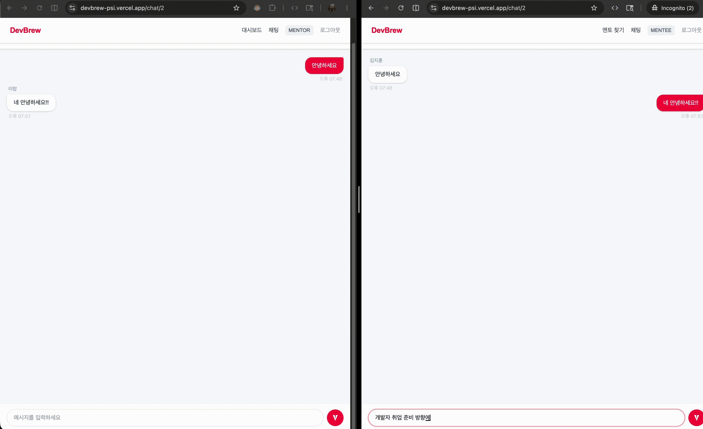
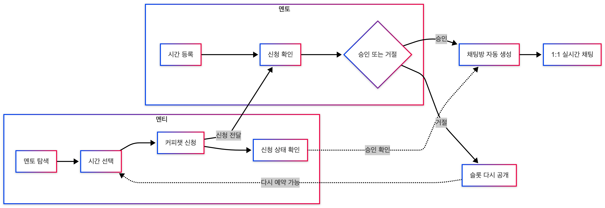
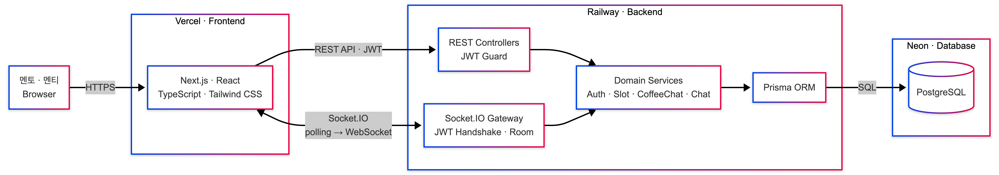
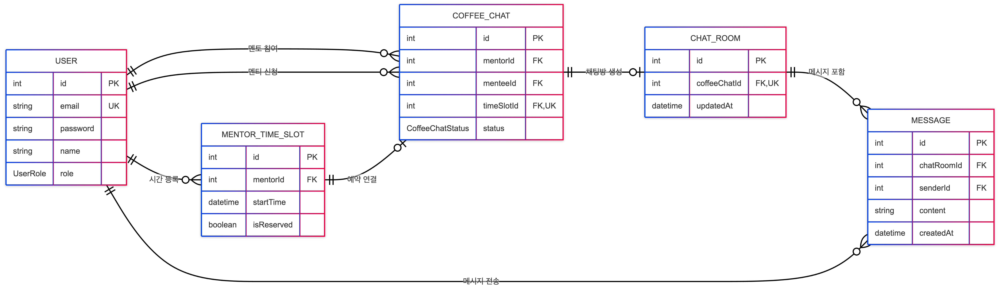

## 예약부터 대화까지, 한 번에 이어지는 개발자 멘토링

멘토를 찾고 시간을 예약하면,
멘토의 승인과 동시에 1:1 채팅이 시작됩니다.

[서비스 데모](https://devbrew-psi.vercel.app) · [GitHub](https://github.com/hellojeff99/devbrew)

`개인 프로젝트` · `풀스택 개발` · `2026.05.14 — 05.24`

|   **9개**   | **14개** |   **5개**   |   **1:1**   |
| :---------: | :------: | :---------: | :---------: |
| 사용자 화면 | REST API | 데이터 모델 | 실시간 채팅 |

---

## 핵심 결과

> **멘토 탐색 → 시간 선택 → 커피챗 신청 → 멘토 승인 → 실시간 채팅**
>
> 흩어져 있던 다섯 단계를 하나의 서비스 흐름으로 완성했습니다.

- **예약 일관성** — 하나의 시간에는 하나의 예약만 연결됩니다.
- **자동 연결** — 승인된 커피챗에는 채팅방이 자동으로 생성됩니다.
- **대화 보존** — 메시지는 저장된 뒤 전달되어 다시 접속해도 유지됩니다.
- **서비스 배포** — 프론트엔드, API, 데이터베이스를 분리했습니다.



---

## 문제 해결

### 01. 중복 예약 차단

**문제**
동일한 시간에 여러 신청이 들어오면 예약 상태가 어긋날 수 있습니다.

**해결**
슬롯 점유와 커피챗 생성을 하나의 트랜잭션으로 처리하고,
`timeSlotId`에 고유 제약을 적용했습니다.

**결과**
**1개 슬롯 : 1개 커피챗** 규칙이 화면 상태와 관계없이 유지됩니다.
거절된 슬롯은 자동으로 다시 예약 가능한 상태가 됩니다.

---

### 02. 승인을 실제 대화로 연결

**문제**
예약이 승인되어도 대화 수단이 따로 있으면 사용자 흐름이 끊깁니다.

**해결**
커피챗 상태를 `PENDING`, `APPROVED`, `REJECTED`로 관리하고,
승인 시 해당 커피챗과 연결된 채팅방을 생성했습니다.

**결과**
사용자는 승인 직후 같은 서비스 안에서 대화를 시작할 수 있습니다.
커피챗과 채팅방의 1:1 관계로 중복 생성을 방지합니다.

---

### 03. 저장과 실시간 전달을 일치

**문제**
화면에 보낸 메시지가 데이터베이스에 남지 않으면 대화 기록을 신뢰할 수 없습니다.

**해결**

```text-flow
메시지 전송 → DB 저장 → 룸 단위 전송 → 양쪽 화면 갱신
```

JWT로 소켓 연결 사용자를 확인하고,
채팅방 참여자만 룸에 입장하도록 검증했습니다.

**결과**
실시간으로 받은 메시지와 다시 불러온 대화 내역이 동일하게 유지됩니다.

---

### 04. 배포 환경의 소켓 연결 안정화

**문제**
로컬에서 동작하던 WebSocket 연결이 Railway 프록시 환경에서는 불안정했습니다.

**해결**

- CORS 허용 주소를 환경 변수로 분리
- polling으로 연결한 뒤 WebSocket으로 전환
- 소켓 생성과 실제 연결 시점을 분리

**결과**
Vercel과 Railway로 분리된 환경에서도 양방향 채팅이 동작했습니다.

---

## 사용자 흐름



---

## 시스템 아키텍처



**핵심**
REST API와 Socket.IO가 같은 도메인 서비스를 사용하고,
모든 영속 데이터는 Prisma를 통해 PostgreSQL에 저장됩니다.


---

## ERD



**핵심 제약**
`timeSlotId`와 `coffeeChatId`에 고유 제약을 적용해
슬롯–커피챗과 커피챗–채팅방의 1:1 관계를 보장합니다.

---

## 구현 범위

- 서비스 기획과 멘토·멘티 사용자 흐름 설계
- 5개 데이터 모델과 관계·고유 제약 정의
- 인증·멘토·슬롯·예약·채팅 API 구현
- 역할별 9개 화면과 실시간 채팅 UI 구현
- 프론트엔드·백엔드·데이터베이스 배포

---

## 검증

- ✅ Frontend 프로덕션 빌드 성공
- ✅ Backend 프로덕션 빌드 성공
- ✅ Backend 기본 테스트 통과
- ✅ 서비스와 GitHub 링크의 HTTP 200 응답 확인

<details>
<summary><strong>상세 설계 문서 보기</strong></summary>

- [API 명세](https://github.com/hellojeff99/devbrew/blob/main/docs/API.md)
- [ERD](https://github.com/hellojeff99/devbrew/blob/main/docs/ERD.md)
- [Socket.IO 설계](https://github.com/hellojeff99/devbrew/blob/main/docs/SOCKET.md)
- [서비스 비즈니스 흐름](https://github.com/hellojeff99/devbrew/blob/main/docs/FLOW.md)

</details>
