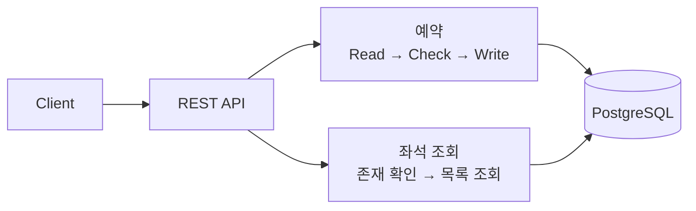
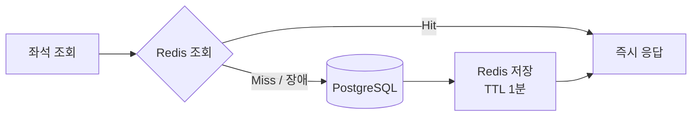
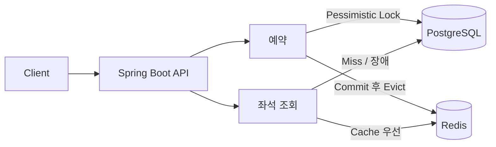

> 티켓 예매의 **중복 예약을 제거**하고, **좌석 조회 p95를 51% 단축**한 성능 개선 프로젝트

## 한눈에 보기

| | 예약 | 좌석 조회 |
| --- | --- | --- |
| **문제** | 같은 좌석에 예약 10건 생성 | 고동시성 p95 504.67ms |
| **선택** | Pessimistic Lock | Redis Cache-Aside |
| **결과** | **중복 9건 → 0건** | **p95 504.67ms → 247.32ms** |

---

## 1. 기존 시스템 - Baseline

모든 읽기와 쓰기가 PostgreSQL에 집중된 구조였습니다.

| 문제 | 측정 결과 |
| --- | ---: |
| Lock 없는 좌석 예약 | 100개 동시 요청에서 **중복 9건** |
| DB 직접 좌석 조회 | 1,000 VU에서 **평균 334.72ms / p95 504.67ms** |

---

## 2. 전략 적용

### 예약 — Pessimistic Lock

동일 좌석에 요청이 집중되는 환경이므로, 충돌 후 실패하는 Optimistic Lock보다 **먼저 접근을 직렬화하는 방식**을 선택했습니다.

`Seat Row Lock → 상태 검증 → 예약 저장 → Commit`

> **선택 이유:** 중복 예약을 막으면서 Optimistic Lock보다 평균 응답이 32.3% 짧았습니다.

| 후보                    | 결과                               | 판단                    |
| ----------------------- | ---------------------------------- | ----------------------- |
| Optimistic Locking      | 중복 방지, 충돌 시 지연 증가       | 충돌이 적은 환경에 적합 |
| **Pessimistic Locking** | 중복 방지, 고경쟁에서 더 낮은 지연 | **티켓 예약에 채택**    |

동일 좌석 요청을 DB Row Lock으로 직렬화해 **한 요청만 예약에 성공**하도록 설계했습니다.

### 조회 — Redis Cache-Aside

반복되는 좌석 조회를 Redis가 우선 처리하도록 읽기 경로를 단축했습니다.

`Cache Hit → 즉시 응답`
`Cache Miss / 장애 → DB 조회 → TTL 1분 저장`

> **변경 반영:** 예약 Commit 후 캐시를 제거하고, Redis 장애 시 DB로 Fallback합니다.

| 후보             | 결과                        | 판단                   |
| ---------------- | --------------------------- | ---------------------- |
| Indexing         | SQL 실행 시간 90.2% 감소    | API 전체 개선은 제한적 |
| **Redis**        | 고동시성 평균·p95 모두 최저 | **조회 전략으로 채택** |
| Indexing + Redis | Baseline보다 개선           | Redis 단독보다 느림    |

---

## 3. 적용 효과

### 예약

1,000개 요청이 하나의 좌석을 동시에 예약한 결과입니다.

| 전략 | 중복 | 평균 | p95 |
| --- | ---: | ---: | ---: |
| Baseline | **9건** | 108.34ms | 165.67ms |
| Optimistic | 0건 | 148.27ms | 240.82ms |
| **Pessimistic** | **0건** | **100.38ms** | **185.73ms** |

**중복 예약 제거** · Optimistic 대비 **평균 32.3%↓** · **p95 22.9%↓**

### 좌석 조회

1,000 VU, 총 10,000회 조회 결과입니다.

| 전략 | 평균 | p95 |
| --- | ---: | ---: |
| Baseline | 334.72ms | 504.67ms |
| Indexing | 308.73ms | 415.00ms |
| **Redis** | **209.42ms** | **247.32ms** |
| Indexing + Redis | 230.82ms | 344.01ms |

**평균 37.4%↓** · **p95 51.0%↓** · **10,000회 조회 성공**

> 복합 인덱스는 SQL을 3.591ms에서 0.352ms로 줄였지만, API 전체에서는 Redis의 개선 폭이 가장 컸습니다.

---

## 4. 최종 설계

| 경로 | 설계 목표 | 결과 |
| --- | --- | --- |
| **Write** | DB Lock으로 정합성 보장 | 좌석당 예약 1건 |
| **Read** | Cache로 반복 조회 흡수 | 고동시성 p95 51% 단축 |

<strong>실험 조건 및 근거 자료</strong>

### 실험 조건

- 예약 정합성: JUnit, 100개 동시 스레드
- 예약 성능: k6, 100 / 500 / 1,000 VU
- 조회 성능: 좌석 100개, VU당 10회 조회
- 쿼리 분석: PostgreSQL `EXPLAIN ANALYZE`

### 근거 자료

- [예약 Lock 전략 비교](./docs/lock-strategy/README.md)
- [좌석 조회 최적화 비교](./docs/read-optimization/README.md)
- [원본 테스트 결과](./reports)

</detail>
